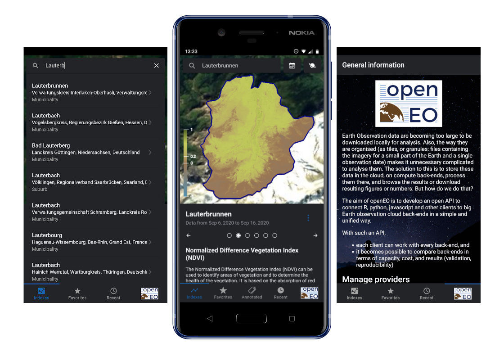

# openEO Demonstrator Mobile App

This is the Android and iOS mobile app demonstrating the possible application of openEO in a mobile environment. It offers requesting
various EO indices from the backend servers listed on the [openEO Hub](https://hub.openeo.org/) (some might require a 
valid subscription to be used) and also allows accessing custom servers supporting the openEO API in the same way.



The mobile app is built using [Ionic](https://ionicframework.com/) with [Angular CLI](https://cli.angular.io/)
and uses the [openEO JavaScript client](https://github.com/Open-EO/openeo-js-client)
to access the openEO servers. Data is visualised on a map using [CesiumJS](https://github.com/AnalyticalGraphicsInc/cesium)
while data from [OpenStreetMap](https://www.openstreetmap.org/) powers a custom geocoding backend 
to search for locations.

## Features

- Searching for geographic features/locations (countries, cities, villages, regions, etc) on a custom-built geocoding backend
- Requesting and visualising EO data for the selected location. Depending on the support from the backend, the following
views may be available:
    - NDVI (Normalised Difference Vegetation Index)
    - NDWI (Normalised Difference Water Index)
    - NDBI (Normalised Difference Built-up Index)
    - NDSI (Normalised Difference Snow Index)
    - False colour image "Agriculture"
    - True colour image
- Storing favourite locations
- Accessing openEO backend servers listed on the openEO Hub (some will require a valid user account, possibly a paid subscription)
and adding custom servers for:
    - Listing data collections
    - Listing processes
    - Listing current jobs (results cannot be viewed within the mobile app)

## Development

The project can be installed locally for development and to run the latest version directly on your Android or iOS
phone in development mode.

### Installation

After cloning the repository, run the following commands to load all the required third-party NPM modules and to prepare
the project for building:

``` bash
$ npm install
$ npm run cordova prepare
```

This should generate the Android and iOS projects. To generate the resources for Android and iOS without having an Ionic
account, you can use the following command instead of `ionic cordova resources`:

```bash
$ npm run ionic cordova resources --cordova-res
```

This is also documented in the ionic-cli issue [#3762](https://github.com/ionic-team/ionic-cli/issues/3762).

### Running in development mode

To run the mobile app on your Android device with live reload enabled, run:

```bash
$ npm run ionic cordova run android -- --device -lc --ssl --no-native-run --external
```

## Continuous integration

Add an environment variable `IOS_BUILD_TEAM` and set it to the Apple Development Team ID used to sign the iOS build.

## License
Copyright 2020 Solenix Schweiz GmbH

Licensed under the Apache License, Version 2.0 (the "License");
you may not use this file except in compliance with the License.
You may obtain a copy of the License at

http://www.apache.org/licenses/LICENSE-2.0

Unless required by applicable law or agreed to in writing, software
distributed under the License is distributed on an "AS IS" BASIS,
WITHOUT WARRANTIES OR CONDITIONS OF ANY KIND, either express or implied.
See the License for the specific language governing permissions and
limitations under the License.

## Funding


This project has received funding from the European Union’s Horizon 2020 research and innovation programme under grant agreement No 776242.
This publication only reflects the author's views; the European Commission is not responsible for any use that may be made of the information it contains.
